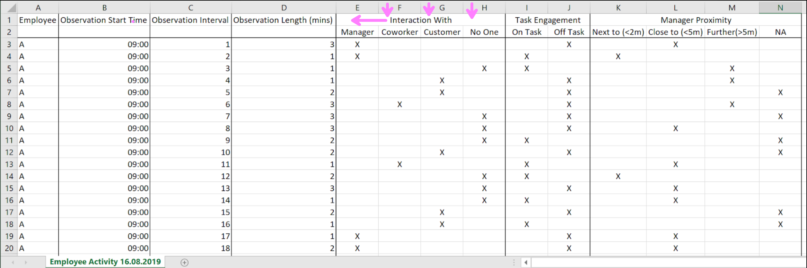
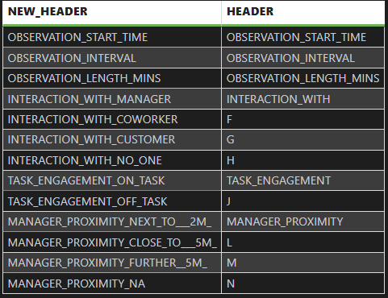

# SQL Dynamic Rename Columns dbt Macro

## CONFIGURED FOR SNOWFLAKE

This macro was not intended to be deployed to production environments without robust testing and review. It was created as a side-project to get more comfortable with using JINJA within dbt.

## Use Cases

This macro is designed to be used in all instances where you want to rename columns of a table based on a mapping table of the structure new_header \| header\.

Some example use cases include when header information is nested across two rows and seeps into the rows of data. Headers being read in as data - with some reshaping we can correct this. Alternatively if you wanted to add a standard prefix to all column headers this macro could be used to save writing out long sql queries for very wide tables.

Example of Nested Headers:


In this example Interaction With is the header for column E, whereas F,G and H have no header and take the default value. In the next row (which will be parsed as a data-row) we have supplementary header info detailing who the interaction is with. Ideally this would be Interaction_With_Manager for column E Interaction_With_Coworker for column F etc.

## Pre-Requisites

The macro requires the user to provide the name of a model that is to be renamed along with the name of a model that returns a mapping table for the renaming with a row for each column.

Example of the Structure expected for the mapping table (Column order matters for the Macro!)



## Macro Script

```


    

    {#- Log the parameters to check their values -#}
    {{- log("rename_table: " ~ rename_table, info=True) -}}
    {{- log("source_relation: " ~ source_relation, info=True) -}}

{#- Section 1 get a dictionary of renames from the model that produces the rename table -#}

    {#- call the table with the rename values -#}
    
    {{- log("rename_table_call: " ~ rename_table_call, info=True) -}}

    {#- run the query and then populate a list of mappings -#}
    
    {{- log("results: " ~ results, info=True) -}}

    {#- empty mappings dictionary to populate with a for loop -#}
    {#- Ensure results are not empty -#}
    
        
        {#- Log the results.rows structure -#}
        {{- log("Results rows structure: " ~ results.rows, info=True) -}}

        {#- for loop to populate mappings -#}
        
            
            
            {{- log("Processing row - Old Header: " ~ old_name ~ ", New Header: " ~ new_name, info=True) -}}
            
        
        {{- log("Updated mappings: " ~ mappings, info=True) -}}

    
        {#- If no results, return an empty string to avoid further errors -#}
        {{- exceptions.raise_compiler_error("Error: No values returned from the rename table query") -}}
    

    {#- Log the mappings dictionary -#}

{#- Section 2: Get the column names for the specified table using the adapter object (this avoids a macro dependency on dbt utils by building the functionality into the macro) -#}

    {#- get the columns from the table to be renamed -#}
    {{- log("source_relation: " ~ source_relation, info=True) -}}

    
    
        {{- log("Column: " ~ column, info=true) -}}
    

    {#- empty dictionary to hold the renaming sql -#}
    

    {#- apply the renaming in a for loop -#}
    
        
        {{- log("Processing column: " ~ col_name, info=True) -}}

        {#- conditional is this a column that has renaming rules -#}
        
            
            {{- log("Renaming column: " ~ col_name ~ " as " ~ new_name, info=True) -}}

            

        

            {{- log("Keeping column: " ~ col_name, info=True) -}}
            


        

    

    {#- Construct and return the final SQL statement -#}
    
    {{- log("Final rename SQL: " ~ final_sql, info=True) -}}
    {{ final_sql }}



{#- dummy sql for parsing phase -#}
select 1




```

## Example Use

If we were to use the macro on the example use case from earlier, a worked example would look like so:

Given the source data (in this case a seed) the start point is staging that data with a standard sql query (I used this as a chance to add a row number in order to help split off the section of the table that needed to be parsed for headers from where the data actually begins).

```sql
-- read in the seed data (rememnber to dbt seed the source data in if you want to walk through the included example.)

with source as (

    select

        *

    from {{ ref('rename_sample_data') }}

),

-- add a source row number as this is important in lots of cases for using a sql query to create a mapping table for the headers.

transformed as (

 select

        *,
        row_number() over (order by null) as row_num

from source

)

select * from transformed
```

The main pre-requisite for using this macro is providing a model that returns a mapping table for headers for guidance on an approach to doing this the model below is one such example:

```sql
-- This is an example query for returning a mapping table for renaming columns and addressing the nested header issue.

-- unpivot the staged model to get header name in the rows In this instance the excluded columns are not pivotted and .

with unpivot as (

    {{ dbt_utils.unpivot(relation=ref('stg_seed_sample_data'), cast_to='varchar', exclude=['employee', 'row_num'], field_name = 'header', value_name = 'subheader') }}

),

-- only take row 1
original_headers as(

    select

        row_number() over (order by null) as col_num,
        header,

    from unpivot

    where row_num = 1

),

-- Prep the headers that need to be renamed, in this case they are all length(1) so are changed to null so their info can be copied down and concatenated with the nested header value.
headers as (

    select

        row_num as rn,
        case
            when length(header) = 1 then null
            else header
        end as header,
        subheader

    from unpivot

    where row_num = 1

),

-- copy down header value using last_value
new_headers as (
    select


        row_number() over (order by null) as col_num,
        case
            when subheader is null then header
            else coalesce(header, last_value(header) ignore nulls over (order by rn rows between unbounded preceding and current row)) || '_' || coalesce(subheader, '')
        end as new_header,


    from headers

),

-- sql databases do not like special characters in the table name so replace these with '_'

rename_table as (

    select

        upper(regexp_replace(h.new_header, '[^A-Za-z0-9_]', '_')) as new_header,

        original_headers.header

    from new_headers h
    inner join original_headers on h.col_num = original_headers.col_num

)

-- end result is a row for every column and THE ORDER IS IMPORTANT, we have new_header followed by original header.

select * from rename_table
```

The other necessary intermediate model is the table with just the data rows included. In this instance it was as simple as a where clause to remove row 1 but in other instances it might be more complicated.

The final thing to demonstrate is the application of the macro in the .sql file as a dbt model compared to how the model is compiled which I have gathered from the target>compile subdirectory.

The model looks like so:

```sql
-- as the rename macro has references back to models, we might have problems with unclear references.
-- this can be avoided two ways, in this version, within the model itself before calling the macro we have added CTEs that refer to the two proceeding models that are needed in the macro. This ensures that this model and the macro within execute after the first two models (otherwise the macro within this model will try and execute before the models are created)

-- the other approach is to tell dbt with a comment statement at the start of the model that specifies dependencies. Like so
-- depends_on: {{ ref('int_seed_data_only_table') }}

with data as (

    select * from {{ ref('int_seed_data_only_table') }}

),

header_mapping as (

    select * from {{ ref('int_seed_header_mapping') }}

),

-- the macro returns a list of column_name1 as new_column_name1, column_name2 as new_column_name2 etc. that are then wrapped in the model with a select and a from for the data that is to be renamed.

renamed_table as (

        select

            {{ dynamic_rename('int_seed_header_mapping','int_seed_data_only_table') }}

        from data

)

select * from renamed_table
```

This compiles as:

```sql
-- as the rename macro has references back to models, we might have problems with unclear references.
-- this can be avoided two ways, in this version, within the model itself before calling the macro we have added CTEs that refer to the two proceeding models that are needed in the macro. This ensures that this model and the macro within execute after the first two models (otherwise the macro within this model will try and execute before the models are created)

-- the other approach is to tell dbt with a comment statement at the start of the model that specifies dependencies. Like so
-- depends_on: TIL_PORTFOLIO_PROJECTS.EH_SQL_DYNAMIC_RENAME.int_seed_data_only_table

with data as (

    select * from TIL_PORTFOLIO_PROJECTS.EH_SQL_DYNAMIC_RENAME.int_seed_data_only_table

),

header_mapping as (

    select * from TIL_PORTFOLIO_PROJECTS.EH_SQL_DYNAMIC_RENAME.int_seed_header_mapping

),

-- the macro returns a list of column_name1 as new_column_name1, column_name2 as new_column_name2 etc. that are then wrapped in the model with a select and a from for the data that is to be renamed.

renamed_table as (

        select

            EMPLOYEE,
OBSERVATION_START_TIME as OBSERVATION_START_TIME,
OBSERVATION_INTERVAL as OBSERVATION_INTERVAL,
OBSERVATION_LENGTH_MINS as OBSERVATION_LENGTH_MINS,
INTERACTION_WITH as INTERACTION_WITH_MANAGER,
F as INTERACTION_WITH_COWORKER,
G as INTERACTION_WITH_CUSTOMER,
H as INTERACTION_WITH_NO_ONE,
TASK_ENGAGEMENT as TASK_ENGAGEMENT_ON_TASK,
J as TASK_ENGAGEMENT_OFF_TASK,
MANAGER_PROXIMITY as MANAGER_PROXIMITY_NEXT_TO___2M_,
L as MANAGER_PROXIMITY_CLOSE_TO___5M_,
M as MANAGER_PROXIMITY_FURTHER__5M_,
N as MANAGER_PROXIMITY_NA,
ROW_NUM

        from data

)

select * from renamed_table
```
